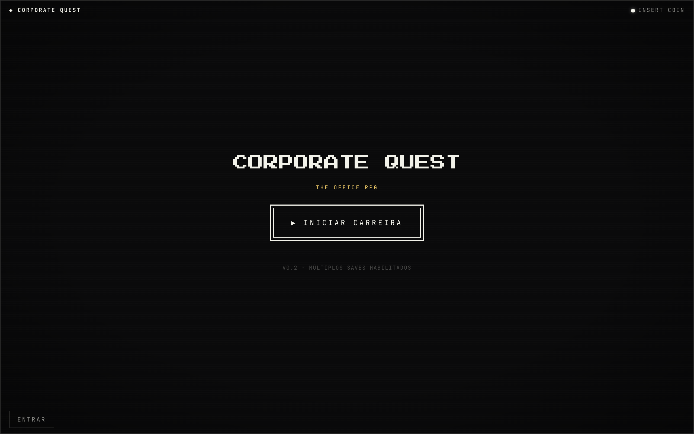
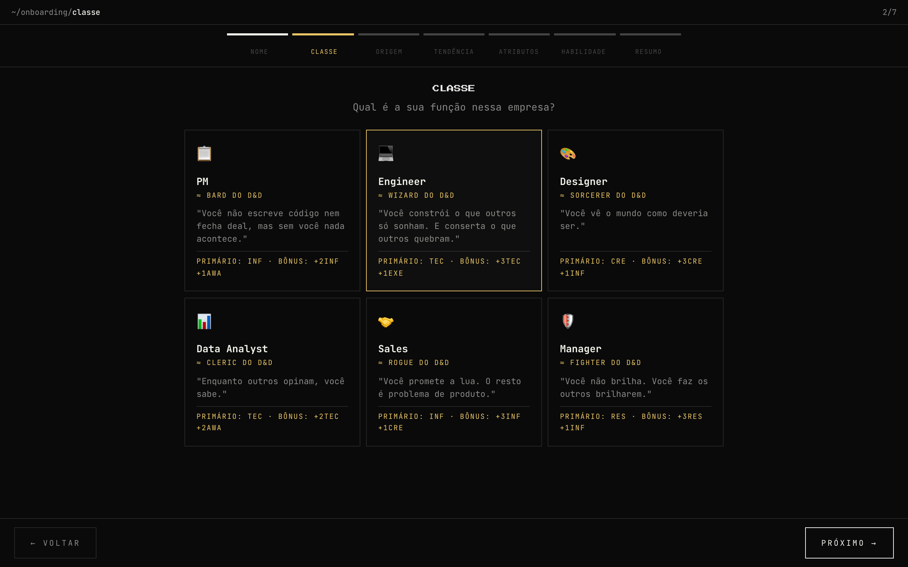
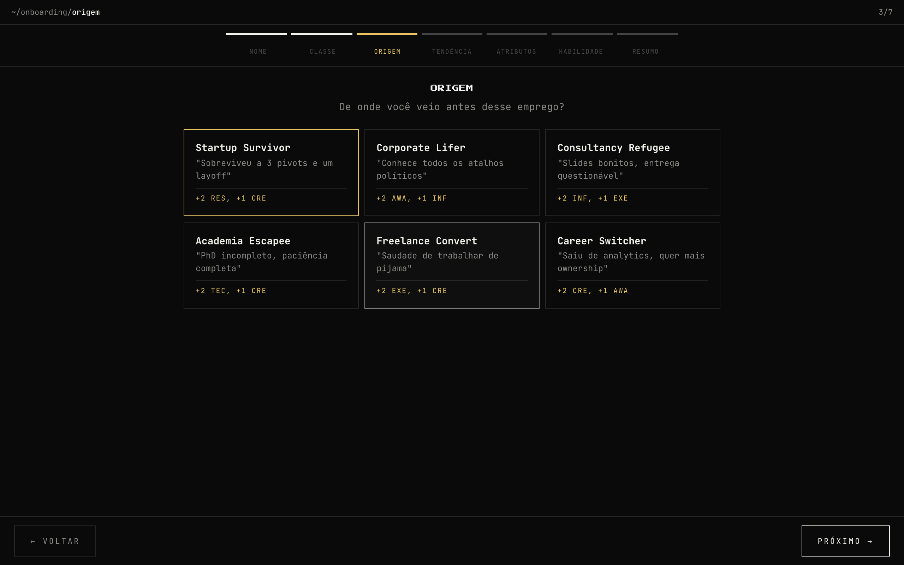
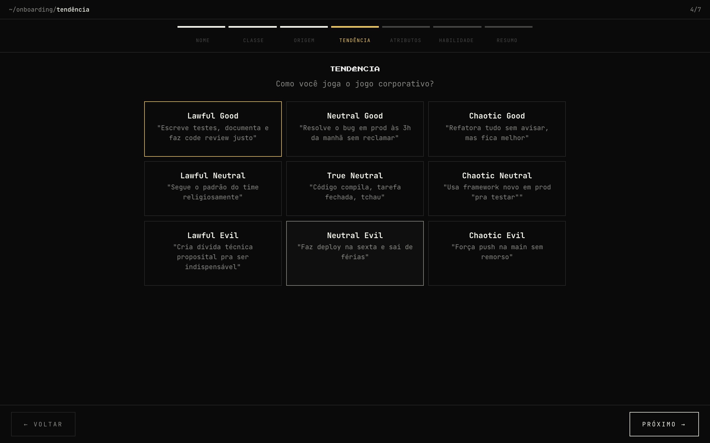
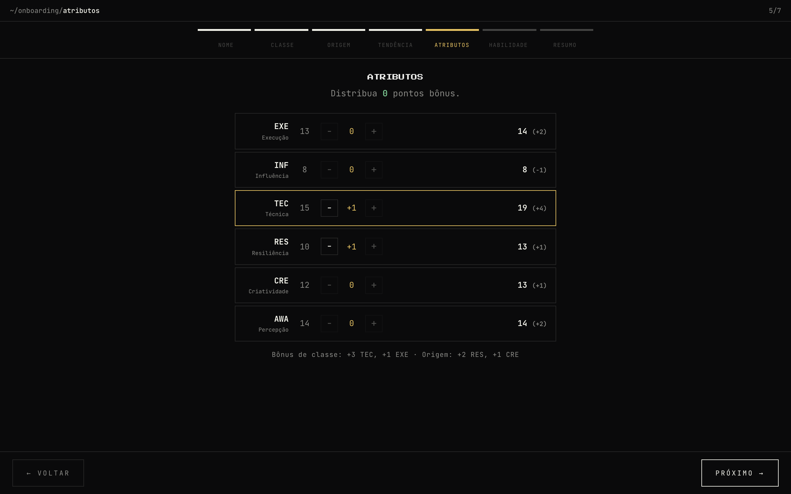
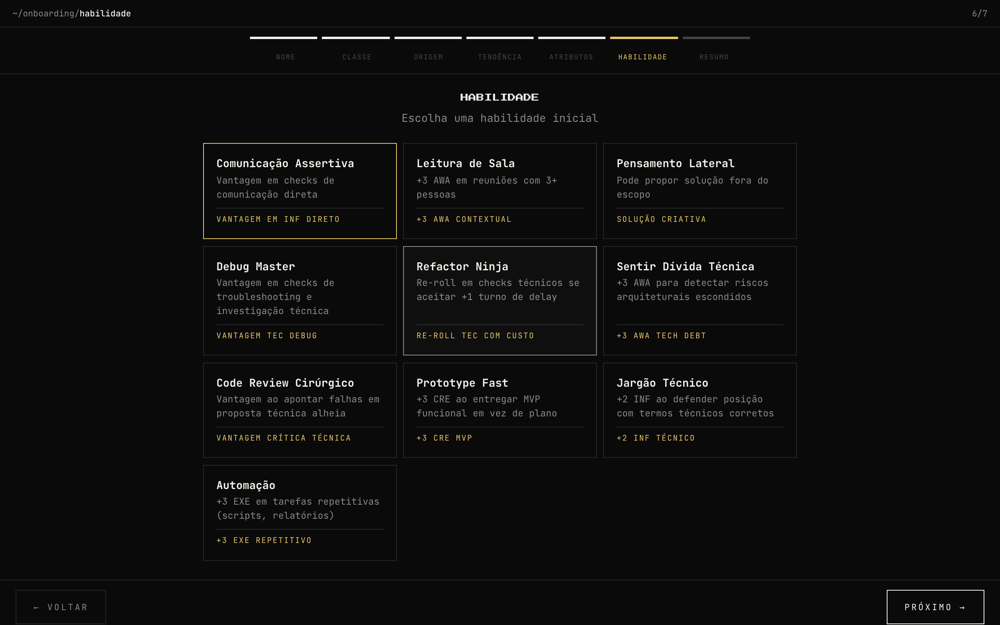
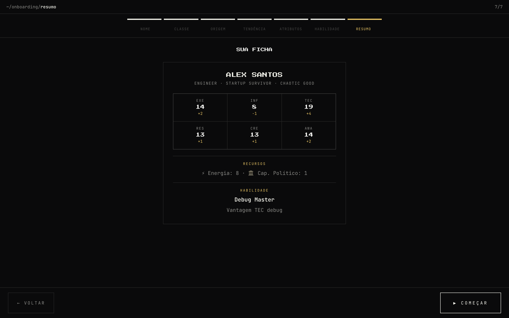
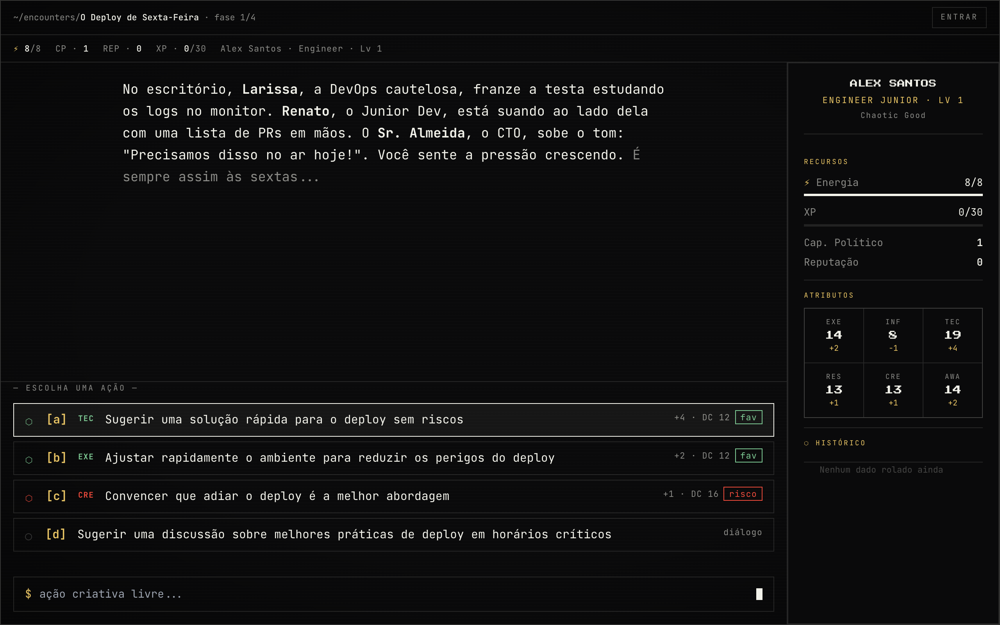
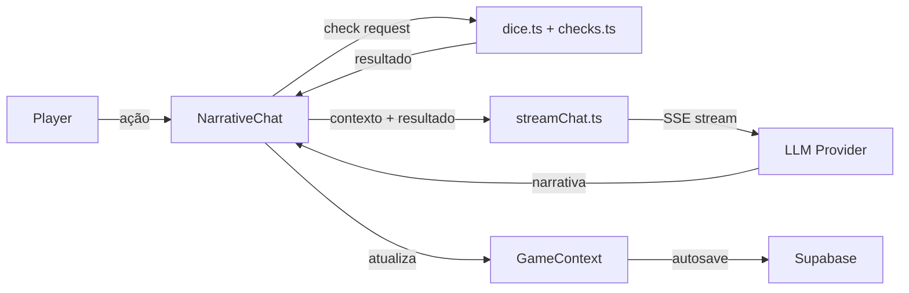

<p align="center">
  
</p>

<h1 align="center">Corporate Quest</h1>
<p align="center">
  <strong>The Office RPG</strong> — onde reuniões são masmorras e e-mails são armadilhas.
</p>

<p align="center">
  <a href="https://github.com/leonardovalim/corporate-quest/stargazers"></a>
  <a href="https://github.com/leonardovalim/corporate-quest/blob/main/LICENSE"></a>
  <a href="https://corporatequest.net"></a>
</p>

<p align="center">
  <a href="https://corporatequest.net">🎮 Jogar agora</a> ·
  <a href="#-o-que-é">📖 Como funciona</a> ·
  <a href="#%EF%B8%8F-self-hosting">🛠️ Self-hosting</a> ·
  <a href="#-mecânicas-do-jogo">🎲 Mecânicas</a> ·
  <a href="CHANGELOG.md">📋 Changelog</a>
</p>

---

## ✨ O que é?

**Corporate Quest** é um RPG de mesa digital ambientado no mundo corporativo. Você interpreta um executivo navegando reuniões absurdas, conflitos políticos e crises de carreira — com mecânicas de dado d20 estilo D&D e narração totalmente gerada por IA.

Cada sessão é única: a IA improvisa NPCs, diálogos e consequências baseadas nas suas escolhas. Nenhum encontro é igual ao anterior.

### Destaques

- 🎭 **Narração 100% por IA** — um mestre de RPG digital que se adapta ao seu estilo
- 🎲 **Dados d20 e 2d10** — sistema de check com críticos, fumbles e vantagem/desvantagem
- 🧑‍💼 **6 classes corporativas** — PM, Engineer, Designer, Data Analyst, Sales e Manager
- 🗺️ **12+ encontros** — de dailys que viram tribunal a leaks na imprensa
- ⚡ **Sistema de energia** — burnout real que afeta suas rolagens
- 🏛️ **Capital político** — gaste para comprar bônus antes de cada encontro
- 🔌 **Multi-LLM** — OpenAI, Anthropic, Google Gemini, Ollama ou custom

---

## 📸 Tour visual

### Criação de personagem

O onboarding em 7 passos guia você pela criação da sua "ficha corporativa":

<table>
  <tr>
    <td align="center" width="50%">
      <br/>
      <sub><b>Classe</b> — cada uma é o equivalente corporativo de uma classe do D&D</sub>
    </td>
    <td align="center" width="50%">
      <br/>
      <sub><b>Origem</b> — de onde você veio antes desse emprego?</sub>
    </td>
  </tr>
  <tr>
    <td align="center">
      <br/>
      <sub><b>Tendência</b> — alinhamento moral com flavor text por classe</sub>
    </td>
    <td align="center">
      <br/>
      <sub><b>Atributos</b> — distribua pontos bônus nos 6 stats</sub>
    </td>
  </tr>
  <tr>
    <td align="center">
      <br/>
      <sub><b>Habilidades</b> — feats com bônus mecânicos reais</sub>
    </td>
    <td align="center">
      <br/>
      <sub><b>Ficha</b> — resumo completo antes de começar</sub>
    </td>
  </tr>
</table>

### Gameplay

<p align="center">
  <br/>
  <sub>Encontro em andamento — narrativa por IA, opções de ação com DC e tags de atributo, ficha na sidebar</sub>
</p>

O gameplay segue o formato de RPG de mesa digital:

1. **O mestre (IA) narra a cena** com NPCs, diálogos e descrições
2. **Você escolhe sua ação** entre as opções sugeridas ou digita uma ação criativa livre
3. **Um dado é rolado** contra a DC do check — sucesso, falha ou crítico
4. **A narrativa avança** baseada no resultado, consumindo energia
5. **Após todas as fases**, você recebe XP, Capital Político e Reputação

---

## 🎲 Mecânicas do jogo

### Classes

| Classe | D&D ≈ | Primário | Bônus | Energia | Flavor |
|--------|-------|----------|-------|---------|--------|
| 📋 **PM** | Bard | INF | +2 INF, +1 AWA | 10 | _"Você não escreve código nem fecha deal, mas sem você nada acontece."_ |
| 💻 **Engineer** | Wizard | TEC | +3 TEC, +1 EXE | 8 | _"Você constrói o que outros só sonham. E conserta o que outros quebram."_ |
| 🎨 **Designer** | Sorcerer | CRE | +3 CRE, +1 INF | 10 | _"Você vê o mundo como deveria ser."_ |
| 📊 **Data Analyst** | Cleric | TEC | +2 TEC, +2 AWA | 10 | _"Enquanto outros opinam, você sabe."_ |
| 🤝 **Sales** | Rogue | INF | +3 INF, +1 CRE | 12 | _"Você promete a lua. O resto é problema de produto."_ |
| 🛡️ **Manager** | Fighter | RES | +3 RES, +1 INF | 12 | _"Você não brilha. Você faz os outros brilharem."_ |

### Atributos

| Atributo | Dado | O que mede |
|----------|------|------------|
| **EXE** — Execução | d20 | Velocidade, entrega, operacional |
| **INF** — Influência | d20 | Persuasão, negociação, política |
| **TEC** — Técnica | d20 | Profundidade técnica, código, dados |
| **RES** — Resiliência | d20 | Resistência a burnout e pressão |
| **CRE** — Criatividade | d20 | Pensamento lateral, soluções inesperadas |
| **AWA** — Percepção | d20 | Leitura de sala, timing político |

### Sistema de energia

A energia é o recurso mais importante — ela limita quantas ações você pode tomar antes de entrar em colapso.

| Estado | Condição | Efeito |
|--------|----------|--------|
| ✅ Normal | > 30% de energia | Sem penalidade |
| ⚠️ Exausto | ≤ 30% de energia | **Disadvantage** em todos os checks |
| 🔥 Burnout | 0 de energia | Disadvantage + penalidade **−3** |

- Check normal: **−1** energia
- Nat 20 (crítico): **0** energia _(flow state)_
- Nat 1 (fumble): **−2** energia _(esforço desperdiçado)_

### Capital Político

Antes de cada encontro, você pode gastar Capital Político para comprar bônus táticos:

- **Bônus passivos** — modificadores permanentes durante o encontro
- **Bônus ativos** — poderes com usos limitados (re-rolls, vantagem, etc.)
- **Tendência** — escolha entre ético, neutro e antiético para desbloquear bônus diferentes

### Sistema de Pressão

```
pressureScore = level − reputation
```

Quanto maior a pressão, mais hostil o ambiente:
- **Pressão baixa** → NPCs amigáveis, DCs mais baixos
- **Pressão alta** → ameaças de PIP, REDACTED, reuniões com o Board
- **Pressão máxima** → encontros podem acabar com REDACTED por justa causa

---

## 🗺️ Encontros

O jogo tem **12 encontros** com dificuldade progressiva. Cada um é narrado pela IA de forma única:

| Encontro | Dificuldade | Level mín. | XP | Descrição |
|----------|-------------|------------|-----|-----------|
| A Daily que Virou Tribunal | 🟢 Fácil | 1 | 25 | Uma standup que escala quando um bug é descoberto |
| A Reunião que Podia Ser um Email | 🟢 Fácil | 1 | 20 | 2h sem pauta. Sobreviva ou transforme em algo útil |
| O Deploy de Sexta-Feira | 🟡 Médio | 1 | 30 | Alguém quer deployar às 17h de sexta |
| PR que Quebrou Produção no Natal | 🟡 Médio | 2 | 35 | Véspera de Natal, 20h. Produção caiu |
| Hackathon Corporativo | 🔴 Difícil | 2 | 40 | 24h para montar time, projeto e apresentar |
| All-Hands com Layoff Surpresa | 🔴 Difícil | 3 | 50 | CEO convocou all-hands, rumores de REDACTED |
| Cliente VIP no WhatsApp do CEO | 🔴 Difícil | 3 | 45 | Áudio de 7min do maior cliente, 23h |
| Auditoria Externa Sem Aviso | 🔴 Difícil | 4 | 55 | Auditores na recepção pedindo acesso a tudo |
| Pitch para o Board com 5min de Aviso | 🔴 Difícil | 4 | 50 | VP "passou mal", você herda o pitch |
| Reorg às 23h59 de Sexta | ⚫ Absurdo | 5 | 65 | Novo chefe, nova área, time desfeito |
| Ex-funcionário Voltou como Seu Chefe | ⚫ Absurdo | 6 | 70 | O cara que você ajudou a demitir voltou. Como VP |
| Vazamento Interno na Imprensa | ⚫ Absurdo | 7 | 80 | Sua mensagem do Slack na capa de um portal tech |

---

## 🛠️ Self-hosting

Você pode hospedar sua própria instância com seu próprio Supabase e provedor de LLM.

### Pré-requisitos

- [Bun](https://bun.sh) (ou Node 18+)
- Conta no [Supabase](https://supabase.com) (plano gratuito é suficiente)
- Chave de API de um LLM (OpenAI, Anthropic, Gemini, etc.) **ou** [Ollama](https://ollama.com) rodando localmente

### 1. Clone e instale

```bash
git clone https://github.com/leonardovalim/corporate-quest.git
cd corporate-quest
bun install
```

### 2. Configure as variáveis de ambiente

```bash
cp .env.example .env
```

Edite `.env` com seus valores:

```env
NEXT_PUBLIC_SUPABASE_URL=https://your-project-id.supabase.co
NEXT_PUBLIC_SUPABASE_PUBLISHABLE_KEY=your_supabase_anon_key
```
Caso não tenha uma conta, crie sua conta no Supabase em https://supabase.com/ e clique em Connect para copiar as variáveis acima.

### 3. Configure o Supabase

1. Crie um novo projeto em [supabase.com](https://supabase.com)
2. Vá em **Settings → API** e copie a **Project URL** e a **anon/public key**
3. No painel do Supabase, abra o **SQL Editor** e execute todas as migrations em ordem:

```
supabase/migrations/*.sql  →  execute cada arquivo no SQL Editor (ordem cronológica)
```

4. Vá em **Authentication → Sign In / Providers** e **habilite "Anonymous sign-ins"**.

   O jogo é jogável sem cadastro, mas a edge function do DM exige um usuário
   autenticado (senão qualquer um consome seus créditos de LLM). O visitante
   sem cadastro entra via sessão anônima. **Sem essa opção ligada, a primeira
   tela do DM não carrega.**

5. Defina a senha do painel admin. A migration `0005` deixa o painel trancado
   até você definir uma — a senha padrão `admin` do `0004` não vale mais, já
   que este repositório é público. No **SQL Editor**:

   ```sql
   UPDATE public.admin_auth
   SET admin_password_hash = extensions.crypt('SUA_SENHA_FORTE', extensions.gen_salt('bf')),
       updated_at = now()
   WHERE id = 1;
   ```

   Depois acesse `/admin` com usuário `admin` e essa senha.

As migrations criam:
- `profiles` — dados de perfil dos usuários
- `game_saves` — saves de partida com RLS (somente o dono acessa)
- `admin_config` — configuração global de LLM (leitura pública, só `ai_config`)
- `admin_auth` — senha e sessão do admin, sem acesso via API
- `game_logs` — logs de eventos por turno

### 4. Configure o LLM

O jogo suporta múltiplos provedores. Você pode configurar de duas formas:

**A) Via painel in-game** (recomendado para uso pessoal)

Após fazer login, clique no ícone de engrenagem → **Configurações de IA** e insira sua chave. A chave fica salva apenas no `localStorage` do seu navegador.

**B) Via painel admin** (força um provedor para todos os usuários)

Acesse `/admin` e na aba **Configuração de IA**, selecione o provedor e modelo.

> ⚠️ **A configuração global não guarda chave de API — por segurança, não por
> limitação.** `admin_config` é de leitura pública (o jogo precisa saber
> provedor/modelo), e mesmo que não fosse, o navegador chama o provedor
> diretamente: uma chave global apareceria no DevTools de qualquer visitante.
> O painel define provedor e modelo; a chave é sempre de quem joga (opção A,
> salva só no `localStorage` dele). Para uma chave compartilhada de verdade, ela
> precisa ficar no servidor, como secret de uma edge function que faz o proxy —
> é o que a `corporate-quest-dm` faz com o provedor padrão.

#### Provedores suportados

| Provedor | Modelos | Necessita chave? |
|----------|---------|--------------------|
| OpenAI | gpt-4o, gpt-4o-mini, o1, o1-mini | Sim |
| Anthropic | claude-sonnet-4, claude-3-opus | Sim |
| Google Gemini | gemini-2.5-flash, gemini-2.5-pro | Sim |
| Ollama | qualquer modelo local | Não |
| Custom | qualquer endpoint OpenAI-compatible | Opcional |

> **Provedor padrão — "Servidor do jogo"**: roteia pela edge function
> `corporate-quest-dm`, que guarda a chave nos secrets e nunca a expõe ao
> navegador. É a única forma segura de servir um LLM para visitantes sem
> cadastro. O destino é escolhido pelo nome do modelo:
>
> | Modelo | Destino | Secret necessário |
> |---|---|---|
> | `gpt-4o`, `gpt-4o-mini`, `gpt-4.1`, `gpt-4.1-mini` | API da OpenAI | `OPENAI_API_KEY` |
> | `google/...`, `openai/gpt-5...` | Gateway da Lovable | `LOVABLE_API_KEY` |
>
> Configure o secret correspondente em **Edge Functions → Secrets**. Sem ele,
> todo turno do DM falha com `503` e uma mensagem dizendo qual secret falta.

Para Ollama local, defina a base URL como `http://localhost:11434` e o modelo desejado (ex: `llama3`, `gemma4`).

### 5. Rode localmente

```bash
bun run dev
# Abre em http://localhost:8080
```

### 6. Deploy (Vercel / Netlify)

Faça deploy como qualquer app Vite. Configure as variáveis de ambiente no painel da plataforma — **não** faça commit do `.env` no repositório.

```bash
bun run build   # Gera dist/
```

---

## 🏗️ Arquitetura

```
corporate-quest/
├── src/
│   ├── components/          # Componentes React (UI)
│   │   ├── HomeScreen.tsx       # Tela inicial / menu
│   │   ├── OnboardingWizard.tsx # Criação de personagem (7 passos)
│   │   ├── GameScreen.tsx       # Tela principal de jogo
│   │   ├── NarrativeChat.tsx    # Chat com a IA (35KB — o coração do jogo)
│   │   ├── CharacterSidebar.tsx # Ficha do personagem
│   │   └── EncounterResultScreen.tsx # Tela de resultado + próxima aventura
│   ├── game/                # Lógica de jogo pura (sem React)
│   │   ├── types.ts             # Tipos TypeScript do sistema
│   │   ├── gameData.ts          # Classes, origens, alinhamentos, feats
│   │   ├── encounter.ts        # Templates de encontros + seleção ponderada
│   │   ├── dice.ts              # Motor de dados (d20, 2d10, vantagem)
│   │   ├── checks.ts            # Sistema de checks (DC, energia, status)
│   │   ├── politicalCapital.ts  # Sistema de bônus por Capital Político
│   │   ├── leveling.ts          # XP, level-up, progressão
│   │   ├── systemPrompt.ts      # Prompt do mestre de RPG para a IA
│   │   └── streamChat.ts       # Streaming multi-provedor (SSE)
│   ├── hooks/               # React hooks customizados
│   └── integrations/        # Supabase client + auth
├── supabase/
│   └── migrations/          # SQL para criar tabelas + RLS
└── docs/
    └── screenshots/         # Prints para o README
```

### Fluxo de dados



---

## 🧪 Comandos de desenvolvimento

```bash
bun run dev        # Servidor na porta 8080
bun run build      # Build de produção
bun run lint       # ESLint
bun run test       # Vitest (execução única)
bun run test:watch # Vitest em modo watch
```
---

## 🧰 Stack

| Camada | Tecnologia |
|--------|-----------|
| **Frontend** | React 18 + TypeScript + Vite |
| **UI** | Tailwind CSS + Radix UI / shadcn |
| **Backend** | Supabase (PostgreSQL + Auth + Edge Functions + RLS) |
| **LLM** | Multi-provider streaming (OpenAI, Anthropic, Gemini, Ollama, Custom) |
| **Testes** | Vitest |

---

## 🤝 Contribuindo

1. Fork o repositório
2. Crie uma branch (`git checkout -b feature/novo-encontro`)
3. Commit suas mudanças (`git commit -m 'Adiciona encontro: nome'`)
4. Push para a branch (`git push origin feature/novo-encontro`)
5. Abra um Pull Request

### Criando novos encontros

Adicione um template em `src/game/encounter.ts`:

```ts
{
  name: 'Nome do Encontro',
  description: 'Descrição curta para o card de seleção',
  totalPhases: 4,
  rewards: { xp: 30, pc: 2, reputation: 1 },
  openingPrompt: 'Instrução para a IA iniciar a narração...',
  difficulty: 'medium',
  minLevel: 1,
}
```

A IA faz o resto — inventa NPCs, diálogos, consequências e rolagens.

---

## 📄 Licença

GPL v3
